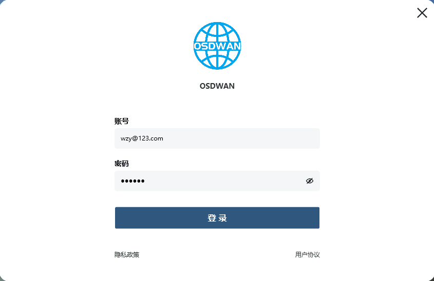
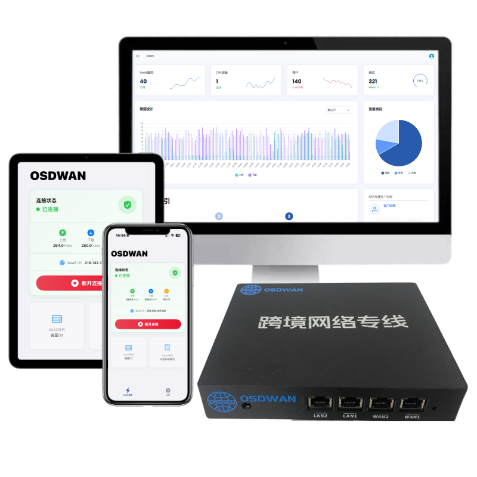

# Google Gemini 国内使用完整指南（2026最新版）

Google Gemini 是 Google 推出的新一代 AI 大模型工具，在代码生成、内容创作、信息整理等方面表现非常出色。

但很多国内用户在使用过程中会遇到：打不开、无法登录、访问不稳定等问题。

本文将从实际使用角度，详细讲清楚 **Gemini 是什么、为什么无法使用、以及如何在国内稳定使用**。

---

## 一、Gemini 是什么？

Gemini 是 Google 推出的 AI 大模型助手，可以理解为：

- ChatGPT 的竞品
- Claude 的同类产品

它可以帮助用户完成多种任务：

- 写文章 / 写邮件
- 代码生成 / 代码优化
- 信息整理与总结
- 翻译与内容改写
- 创意方案生成

同时，Gemini 还与 Google 生态深度集成，例如：

- Gmail
- Google Docs
- Google Drive

对于以下人群非常实用：

- 程序员
- 内容创作者
- 外贸从业者
- 海外业务团队

---

## 二、Gemini 在国内为什么无法直接使用？

很多用户会遇到以下问题：

- 页面无法打开
- Google 账号无法登录
- 提示地区不支持
- 访问速度极慢或超时

主要原因有两个：

### 1. 网络访问限制

Gemini 部署在 Google 海外服务器上。

在国内网络环境下，Google 相关服务访问会受到限制，因此可能出现：

- 连接失败
- 页面加载异常
- API 超时

---

### 2. 地区与账号环境限制

Gemini 对账号和访问环境有一定区域要求：

- IP 所属地区
- Google 账号环境
- 网络出口稳定性

如果环境不符合要求，也可能无法正常使用。

---

## 三、Gemini 在国内怎么使用？

目前常见方式有三种：

---

### 1. 使用海外网络环境

通过海外网络访问 Gemini，可以解决基础访问问题。

当访问环境被识别为海外地区时，一般可以正常使用。

但问题是：

- 连接不稳定
- 速度慢
- 容易掉线

---

### 2. 使用跨境网络专线（推荐长期使用）

如果是长期使用 Gemini / ChatGPT / Claude 等 AI 工具，通常建议使用：

- SD-WAN 跨境网络
- 企业级国际专线
- 稳定原生 IP 网络

例如 OSDWAN 提供的跨境网络解决方案，可以用于：

- 海外 AI 工具访问
- 跨境办公
- 外贸业务
- 社媒运营

特点包括：

- 网络更稳定
- 延迟更低
- 长时间不掉线

---

👉 点此添加 OSDWAN 顾问了解详情

---

### 3. 使用 Google AI Studio（开发者方式）

开发者可以通过：

- Gemini API
- Google AI Studio

直接调用模型能力。

适用于：

- AI 应用开发
- 自动化工具搭建
- API 集成项目

---

## 四、如何使用 OSDWAN 稳定访问 Gemini？

OSDWAN 支持软件与硬件多种接入方式，并提供企业级跨境网络能力。

### 使用步骤如下：

#### 1. 咨询顾问

说明使用需求，选择合适套餐。

#### 2. 开通账号

提交信息，由技术人员完成配置。

#### 3. 下载并安装客户端

登录账号后即可连接使用。

#### 4. 开始访问 Gemini

连接成功后即可正常访问：

- Google Gemini
- ChatGPT
- Claude
- 其他海外 AI 工具
---

### 硬件接入步骤：

1. 收到设备  
2. 设备通电  
3. 连接线路  
4. 连接 WiFi  
5. 访问海外服务  

---

## 五、OSDWAN 的核心优势

### 1. 稳定连接，减少中断

采用：

- 运营商级国际专线
- SD-WAN 智能调度

有效降低：

- 丢包
- 延迟
- 抖动

提升 AI 工具使用稳定性。

---

### 2. 长期稳定可用

提供稳定跨境网络出口环境，降低：

- 登录异常
- 风控触发
- IP 受限问题

---

### 3. 全球节点覆盖

覆盖：

- 50+ 数据中心
- 200+ POP 节点
- 300+ 国家地区

提升访问速度与稳定性。

---

### 4. 多终端支持

支持：

- Windows
- Mac
- iPhone
- Android
- iPad

支持企业统一管理。

---

## 总结

Google Gemini 在国内无法直接使用，主要原因是：

- 网络访问限制
- 地区与账号环境限制

解决方式：

- 临时使用：海外网络环境
- 长期使用：跨境网络专线（推荐）

如果需要稳定使用 Gemini、ChatGPT、Claude 等 AI 工具，建议选择稳定的网络方案，以保证体验一致性。

---

## 关于 OSDWAN

OSDWAN 是专业跨境网络服务提供商，专注为企业与开发者提供稳定的海外网络能力。

提供：

- SD-WAN 国际专线
- 海外 AI 加速
- SaaS 加速
- 跨境组网
- 云专线

适用于：

- AI 工具访问
- 外贸企业
- 跨境电商
- 社媒运营
- 海外业务团队

---

联系方式：
- 售前：15073104040（微信同号）  
- 软件选型顾问：15673187032（微信同号）

